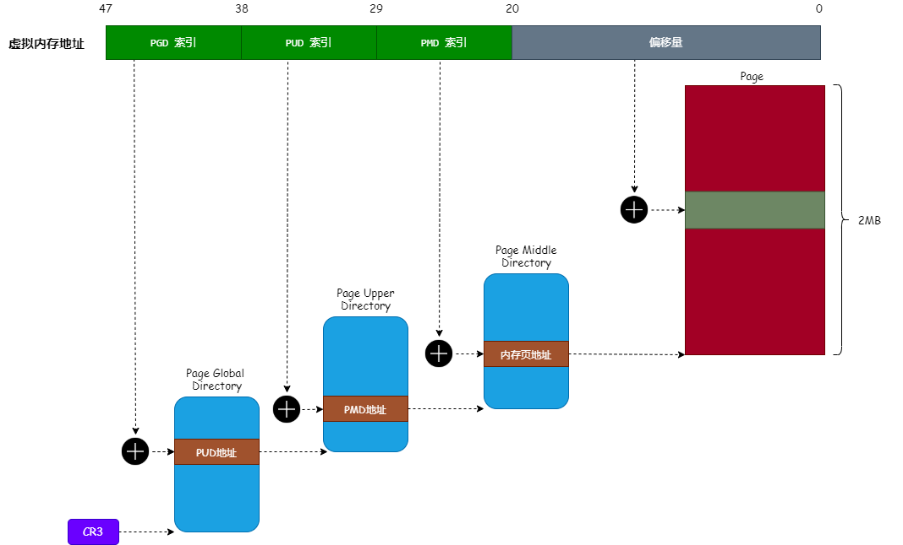

# HugePages源码分析

在《[一文读懂 HugePages的原理](https://mp.weixin.qq.com/s/oOki5zw_Y0BL0KaehvcGrw)》一文中介绍了 HugePages（大内存页）的原理和使用，现在我们来分析一下 Linux 内核是怎么实现 HugePages 分配的。

>   本文使用 Linux 内核 2.6.23 版本

## HugePages分配器初始化

在内核初始化时，会调用 `hugetlb_init` 函数对 HugePages 分配器进行初始化，其实现如下：

```c
static int __init hugetlb_init(void)
{
    unsigned long i;

    // 1. 初始化空闲大内存页链表 hugepage_freelists, 
    //    内核使用 hugepage_freelists 链表把空闲的大内存页连接起来,
    //    为了分析简单，我们可以把 MAX_NUMNODES 当成 1
    for (i = 0; i < MAX_NUMNODES; ++i)          
        INIT_LIST_HEAD(&hugepage_freelists[i]); 

    // 2. max_huge_pages 为系统能够使用的大页内存的数量,
    //    由系统启动项 hugepages 指定,
    //    这里主要申请大内存页, 并且保存到 hugepage_freelists 链表中.
    for (i = 0; i < max_huge_pages; ++i) {
        if (!alloc_fresh_huge_page())
            break;
    }

    max_huge_pages = free_huge_pages = nr_huge_pages = i;

    return 0;
}
```

`hugetlb_init` 函数主要完成两个工作：

*   初始化空闲大内存页链表 `hugepage_freelists`，这个链表保存了系统中能够使用的大内存。
*   为系统申请空闲的大内存页，并且保存到 `hugepage_freelists` 链表中。

我们再来分析下 `alloc_fresh_huge_page` 函数是怎么申请大内存页的，其实现如下：

```c
static int alloc_fresh_huge_page(void)
{
    static int prev_nid;
    struct page *page;
    int nid;
    ...
    // 1. 申请一个大的物理内存页...
    page = alloc_pages_node(nid, htlb_alloc_mask|__GFP_COMP|__GFP_NOWARN,
                            HUGETLB_PAGE_ORDER);

    if (page) {
        // 2. 设置释放大内存页的回调函数为 free_huge_page
        set_compound_page_dtor(page, free_huge_page); 
        ...
        // 3. put_page 函数将会调用上面设置的 free_huge_page 函数把内存页放入到缓存队列中
        put_page(page);

        return 1;
    }

    return 0;
}
```

所以，`alloc_fresh_huge_page` 函数主要完成三个工作：

*   调用 `alloc_pages_node` 函数申请一个大内存页（2MB）。
*   设置大内存页的释放回调函数为 `free_huge_page`，当释放大内存页时，将会调用这个函数进行释放操作。
*   调用 `put_page` 函数释放大内存页，其将会调用 `free_huge_page` 函数进行相关操作。

那么，我们来看看 `free_huge_page` 函数是怎么释放大内存页的，其实现如下：

```c
static void free_huge_page(struct page *page)
{
    ...
    enqueue_huge_page(page);     // 把大内存页放置到空闲大内存页链表中
    ...
}
```

`free_huge_page` 函数主要调用 `enqueue_huge_page` 函数把大内存页添加到空闲大内存页链表中，其实现如下：

```c
static void enqueue_huge_page(struct page *page)
{
    int nid = page_to_nid(page); // 我们假设这里一定返回 0

    // 把大内存页添加到空闲链表 hugepage_freelists 中
    list_add(&page->lru, &hugepage_freelists[nid]);

    // 增加计数器
    free_huge_pages++;
    free_huge_pages_node[nid]++;
}
```

从上面的实现可知，`enqueue_huge_page` 函数只是简单的把大内存页添加到空闲链表 `hugepage_freelists` 中，并且增加计数器。

假如我们设置了系统能够使用的大内存页为 100 个，那么空闲大内存页链表 `hugepage_freelists` 的结构如下图所示：


所以，HugePages 分配器初始化的调用链为：

```asp
hugetlb_init()
      |
      +——> alloc_fresh_huge_page()
                      |
                      |——> alloc_pages_node()
                      |——> set_compound_page_dtor()
                      +——> put_page()
                               |
                               +——> free_huge_page()
                                            |
                                            +——> enqueue_huge_page()
```

## hugetlbfs 文件系统

为系统准备好空闲的大内存页后，现在来了解下怎样分配大内存页。在《[一文读懂 HugePages的原理](https://mp.weixin.qq.com/s/oOki5zw_Y0BL0KaehvcGrw)》一文中介绍过，要申请大内存页，必须使用 `mmap` 系统调用把虚拟内存映射到 `hugetlbfs` 文件系统中的文件中。

免去繁琐的文件系统挂载过程，我们主要来看看当使用 `mmap` 系统调用把虚拟内存映射到 `hugetlbfs` 文件系统的文件时会发生什么事情。

每个文件描述符对象都有个 `mmap` 的方法，此方法会在调用 `mmap` 函数映射到文件时被触发，我们来看看 `hugetlbfs` 文件的 `mmap` 方法所对应的真实函数，如下：

```c
const struct file_operations hugetlbfs_file_operations = {
    .mmap               = hugetlbfs_file_mmap,
    .fsync              = simple_sync_file,
    .get_unmapped_area  = hugetlb_get_unmapped_area,
};
```

从上面的代码可以发现，`hugetlbfs` 文件的 `mmap` 方法被设置为 `hugetlbfs_file_mmap` 函数。所以当调用 `mmap` 函数映射 `hugetlbfs` 文件时，将会调用 `hugetlbfs_file_mmap` 函数来处理。

而 `hugetlbfs_file_mmap` 函数最主要的工作就是把虚拟内存分区对象的 `vm_flags` 字段添加 `VM_HUGETLB` 标志位，如下代码：

```c
static int 
hugetlbfs_file_mmap(struct file *file, struct vm_area_struct *vma)
{
    ...
    vma->vm_flags |= VM_HUGETLB | VM_RESERVED; // 为虚拟内存分区添加 VM_HUGETLB 标志位
    ...
    return ret;
}
```

为虚拟内存分区对象设置 `VM_HUGETLB` 标志位的作用是：当对虚拟内存分区进行物理内存映射时，会进行特殊的处理，下面将会介绍。

## 虚拟内存与物理内存映射

使用 `mmap` 函数映射到 `hugetlbfs` 文件后，会返回一个虚拟内存地址。当对这个虚拟内存地址进行访问（读写）时，由于此虚拟内存地址还没有与物理内存地址进行映射，将会触发 `缺页异常`，内核会调用 `do_page_fault` 函数对 `缺页异常` 进行修复。

我们来看看整个流程，如下图所示：


所以，最终会调用 `do_page_fault` 函数对 `缺页异常` 进行修复操作，我们来看看 `do_page_fault` 做了什么工作，实现如下：

```c
asmlinkage void
__kprobes do_page_fault(struct pt_regs *regs, unsigned long error_code)
{
    ...
    struct mm_struct *mm;
    struct vm_area_struct *vma;
    unsigned long address;
    ...

    mm = tsk->mm;         // 1. 获取当前进程对应的内存管理对象
    address = read_cr2(); // 2. 获取触发缺页异常的虚拟内存地址

    ...
    vma = find_vma(mm, address); // 3. 通过虚拟内存地址获取对应的虚拟内存分区对象
    ...

    // 4. 调用 handle_mm_fault 函数对异常进行修复
    fault = handle_mm_fault(mm, vma, address, write);
    ...

    return;
}
```

上面代码对 `do_page_fault` 进行了精简，精简后主要完成4个工作：

*   获取当前进程对应的内存管理对象。
*   调用 `read_cr2` 获取触发缺页异常的虚拟内存地址。
*   通过触发 `缺页异常` 的虚拟内存地址获取对应的虚拟内存分区对象。
*   调用 `handle_mm_fault` 函数对 `缺页异常` 进行修复。

我们继续来看看 `handle_mm_fault` 函数的实现，代码如下：

```c
int handle_mm_fault(struct mm_struct *mm, struct vm_area_struct *vma,
                    unsigned long address, int write_access)
{
    ...
    if (unlikely(is_vm_hugetlb_page(vma))) // 虚拟内存分区是否需要使用 HugePages
        return hugetlb_fault(mm, vma, address, write_access); // 如果使用 HugePages, 就调用 hugetlb_fault 进行处理
    ...
}
```

对 `handle_mm_fault` 函数进行精简后，逻辑就非常清晰。如果虚拟内存分区使用 HugePages，那么就调用 `hugetlb_fault` 函数进行处理（由于我们分析使用 HugePages 的情况，所以刚好进入这个分支）。

`hugetlb_fault` 函数主要对进程的页表进行填充，所以我们先来回顾一下 HugePages 对应的页表结构，如下图：




从上图可以看出，使用 HugePages 后，`页中间目录` 直接指向物理内存页。所以，`hugetlb_fault` 函数主要就是对 `页中间目录项` 进行填充。其实现如下：

```c
int hugetlb_fault(struct mm_struct *mm, struct vm_area_struct *vma,
                  unsigned long address, int write_access)
{
    pte_t *ptep;
    pte_t entry;
    int ret;
    
    ptep = huge_pte_alloc(mm, address); // 1. 找到虚拟内存地址对应的页中间目录项
    ...
    entry = *ptep;

    if (pte_none(entry)) { // 如果页中间目录项还没进行映射
        // 2. 那么调用 hugetlb_no_page 函数进行映射操作
        ret = hugetlb_no_page(mm, vma, address, ptep, write_access);
        ...
        return ret;
    }
    ...
}
```

对 `hugetlb_fault` 函数进行精简后，主要完成两个工作：

*   通过触发 `缺页异常` 的虚拟内存地址找到其对应的 `页中间目录项`。
*   调用 `hugetlb_no_page` 函数对 `页中间目录项` 进行映射操作。

我们再来看看 `hugetlb_no_page` 函数怎么对 `页中间目录项` 进行填充：

```c
static int
hugetlb_no_page(struct mm_struct *mm, struct vm_area_struct *vma,
                unsigned long address, pte_t *ptep, int write_access)
{
    ...
    page = find_lock_page(mapping, idx);
    if (!page) {
        ...
        // 1. 从空闲大内存页链表 hugepage_freelists 中申请一个大内存页
        page = alloc_huge_page(vma, address);
        ...
    }
    ...
    // 2. 通过大内存页的物理地址生成页中间目录项的值
    new_pte = make_huge_pte(vma, page, ((vma->vm_flags & VM_WRITE)
                                            && (vma->vm_flags & VM_SHARED)));

    // 3. 设置页中间目录项的值为上面生成的值
    set_huge_pte_at(mm, address, ptep, new_pte);
    ...
    return ret;
}
```

通过对 `hugetlb_no_page` 函数进行精简后，主要完成3个工作：

*   调用 `alloc_huge_page` 函数从空闲大内存页链表 `hugepage_freelists` 中申请一个大内存页。
*   通过大内存页的物理地址生成页中间目录项的值。
*   设置页中间目录项的值为上面生成的值。

至此，HugePages 的映射过程已经完成。

>   还有个问题，就是 CPU 怎么知道 `页中间表项` 指向的是 `页表` 还是 `大内存页` 呢？
>
>   这是因为  `页中间表项` 有个 `PSE` 的标志位，如果将其设置为1，那么就表明其指向 `大内存页` ，否则就指向 `页表`。

## 总结

本文介绍了 HugePages 实现的整个流程，当然本文也只是介绍了申请内存的流程，释放内存的流程并没有分析，如果有兴趣的话可以自己查阅源码。


