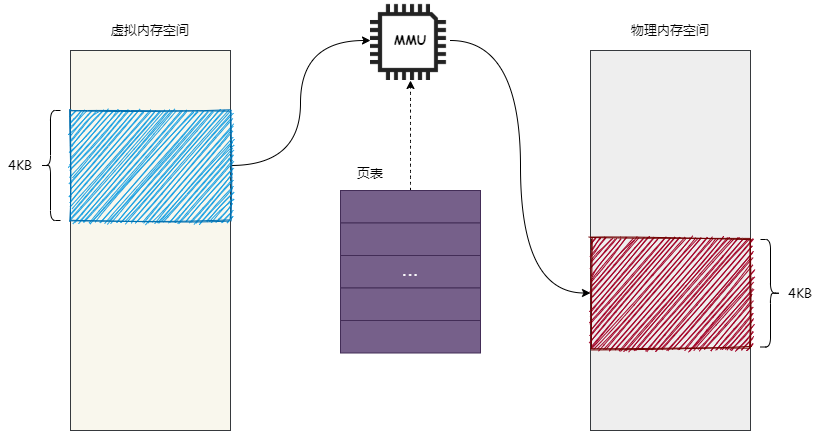
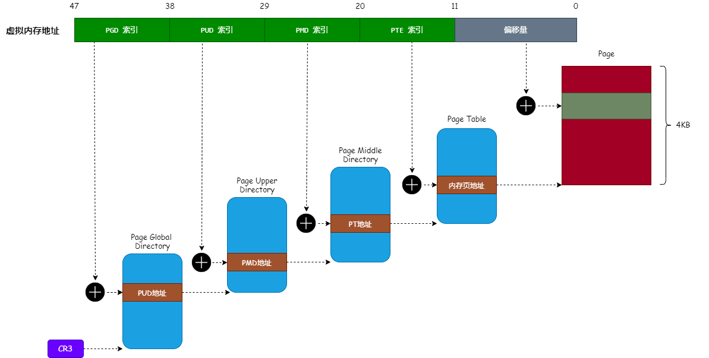

# Linux HugePages（大内存页） 原理与使用

在介绍 `HugePages` 之前，我们先来回顾一下 Linux 下 `虚拟内存` 与 `物理内存` 之间的关系。

*   `物理内存`：也就是安装在计算机中的内存条，比如安装了 2GB 大小的内存条，那么物理内存地址的范围就是 0 ~ 2GB。
*   `虚拟内存`：虚拟的内存地址。由于 CPU 只能使用物理内存地址，所以需要将虚拟内存地址转换为物理内存地址才能被 CPU 使用，这个转换过程由 `MMU（Memory Management Unit，内存管理单元）` 来完成。在 32 位的操作系统中，虚拟内存空间大小为 0 ~ 4GB。

我们通过 图1 来描述虚拟内存地址转换成物理内存地址的过程：




如 图1 所示，`页表` 保存的是虚拟内存地址与物理内存地址的映射关系，`MMU` 从 `页表` 中找到虚拟内存地址所映射的物理内存地址，然后把物理内存地址提交给 CPU，这个过程与 Hash 算法相似。

内存映射是以内存页作为单位的，通常情况下，一个内存页的大小为 4KB（如图1所示），所以称为 `分页机制`。

## 一、内存映射

我们来看看在 64 位的 Linux 系统中（英特尔 x64 CPU），虚拟内存地址转换成物理内存地址的过程，如图2：




从图2可以看出，Linux 只使用了 64 位虚拟内存地址的前 48 位（0 ~ 47位），并且 Linux 把这 48 位虚拟内存地址分为 5 个部分，如下：

*   `PGD索引`：39 ~ 47 位（共9个位），指定在 `页全局目录`（PGD，Page Global Directory）中的索引。
*   `PUD索引`：30 ~ 38 位（共9个位），指定在 `页上级目录`（PUD，Page Upper Directory）中的索引。
*   `PMD索引`：21 ~ 29 位（共9个位），指定在 `页中间目录`（PMD，Page Middle Directory）中的索引。
*   `PTE索引`：12 ~ 20 位（共9个位），指定在 `页表`（PT，Page Table）中的索引。
*   `偏移量`：0 ~ 11 位（共12个位），指定在物理内存页中的偏移量。

把 图1 中的 `页表` 分为 4 级：`页全局目录`、`页上级目录`、`页中间目录` 和 `页表` 目的是为了减少内存消耗（思考下为什么可以减少内存消耗）。

>   注意：页全局目录、页上级目录、页中间目录 和 页表 都占用一个 4KB 大小的物理内存页，由于 64 位内存地址占用 8 个字节，所以一个 4KB 大小的物理内存页可以容纳 512 个 64 位内存地址。

另外，CPU 有个名为 `CR3` 的寄存器，用于保存 `页全局目录` 的起始物理内存地址（如图2所示）。所以，虚拟内存地址转换成物理内存地址的过程如下：

*   从 `CR3` 寄存器中获取 `页全局目录` 的物理内存地址，然后以虚拟内存地址的 39 ~ 47 位作为索引，从 `页全局目录` 中读取到 `页上级目录` 的物理内存地址。
*   以虚拟内存地址的 30 ~ 38 位作为索引，从 `页上级目录` 中读取到 `页中间目录` 的物理内存地址。
*   以虚拟内存地址的 21 ~ 29 位作为索引，从 `页中间目录` 中读取到 `页表` 的物理内存地址。
*   以虚拟内存地址的 12 ~ 20 位作为索引，从 `页表` 中读取到 `物理内存页` 的物理内存地址。
*   以虚拟内存地址的 0 ~ 11 位作为 `物理内存页` 的偏移量，得到最终的物理内存地址。

## 二、HugePages 原理

上面介绍了以 4KB 的内存页作为内存映射的单位，但有些场景我们希望使用更大的内存页作为映射单位（如 2MB）。使用更大的内存页作为映射单位有如下好处：

*   减少 `TLB（Translation Lookaside Buffer）` 的失效情况。
*   减少 `页表` 的内存消耗。
*   减少 PageFault（缺页中断）的次数。

>   Tips：`TLB` 是一块高速缓存，TLB 缓存虚拟内存地址与其映射的物理内存地址。MMU 首先从 TLB 查找内存映射的关系，如果找到就不用回溯查找页表。否则，只能根据虚拟内存地址，去页表中查找其映射的物理内存地址。

因为映射的内存页越大，所需要的 `页表` 就越小（很容易理解）；`页表` 越小，TLB 失效的情况就越少。

使用大于 4KB 的内存页作为内存映射单位的机制叫 `HugePages`，目前 Linux 常用的 HugePages 大小为 2MB 和 1GB，我们以 2MB 大小的内存页作为例子。

要映射更大的内存页，只需要增加偏移量部分，如 图3 所示：


如 图3 所示，现在把偏移量部分扩展到 21 位（页表部分被覆盖了，21 位能够表示的大小范围为 0 ~ 2MB），所以 `页中间目录` 直接指向映射的 `物理内存页地址`。

这样，就可以减少 `页表` 部分的内存消耗。由于内存映射关系变少，所以 TLB 失效的情况也会减少。

## 三、HugePages 使用

了解了 HugePages 的原理后，我们来介绍一下怎么使用 HugePages。

HugePages 的使用不像普通内存申请那么简单，而是需要借助 `Hugetlb文件系统` 来创建，下面将会介绍 HugePages 的使用步骤：

### 1. 挂载 Hugetlb 文件系统

Hugetlb 文件系统是专门为 HugePages 而创造的，我们可以通过以下命令来挂载一个 Hugetlb 文件系统：

```shell
$ mkdir /mnt/huge
$ mount none /mnt/huge -t hugetlbfs
```

执行完上面的命令后，我们就在 `/mnt/huge` 目录下挂载了 Hugetlb 文件系统。

### 2. 初始化 HugePages

要使用 HugePages，首先要向内核声明可以使用的 HugePages 数量。`/proc/sys/vm/nr_hugepages` 文件保存了内核可以使用的 HugePages 数量，我们可以使用以下命令设置新的可用 HugePages 数量：

```shell
$ echo 20 > /proc/sys/vm/nr_hugepages
```

上面命令设置了可用的 HugePages 数量为 20 个（也就是 20 个 2MB 的内存页）。

### 3. 编写申请 HugePages 的代码

要使用 HugePages，必须使用 `mmap` 系统调用把虚拟内存映射到 Hugetlb 文件系统中的文件，如下代码：

```c
#include <fcntl.h>
#include <sys/mman.h>
#include <errno.h>
#include <stdio.h>

 #define MAP_LENGTH (10*1024*1024) // 10MB

 int main()
 {
    int fd;
    void * addr;

    /* 1. 创建一个 Hugetlb 文件系统的文件 */
    fd = open("/mnt/huge/hugepage1", O_CREAT|O_RDWR);
    if (fd < 0) {
        perror("open()");
        return -1;
    }

    /* 2. 把虚拟内存映射到 Hugetlb 文件系统的文件中 */
    addr = mmap(0, MAP_LENGTH, PROT_READ|PROT_WRITE, MAP_SHARED, fd, 0);
    if (addr == MAP_FAILED) {
        perror("mmap()");
        close(fd);
        unlink("/mnt/huge/hugepage1");
        return -1;
    }

    strcpy(addr, "This is HugePages example...");
    printf("%s\n", addr);

    /* 3. 使用完成后，解除映射关系 */
    munmap(addr, MAP_LENGTH);
    close(fd);
    unlink("/mnt/huge/hugepage1");

    return 0;
 }
```

编译上面的代码并且执行，如果没有问题，将会输出以下信息：

```
This is HugePages example...
```

## 四、总结

本文主要介绍了 HugePages 的原理和使用，虽然 HugePages 有很多优点，但也有其不足的地方。比如调用 `fork` 系统调用创建子进程时，内核使用了 `写时复制` 的技术（可参考《[Linux 写时复制机制原理](https://mp.weixin.qq.com/s/e6VESPfZPPWpy2emZEGK_g)》一文），在父子进程内存发生改变时，需要复制更大的内存页，从而影响性能。


