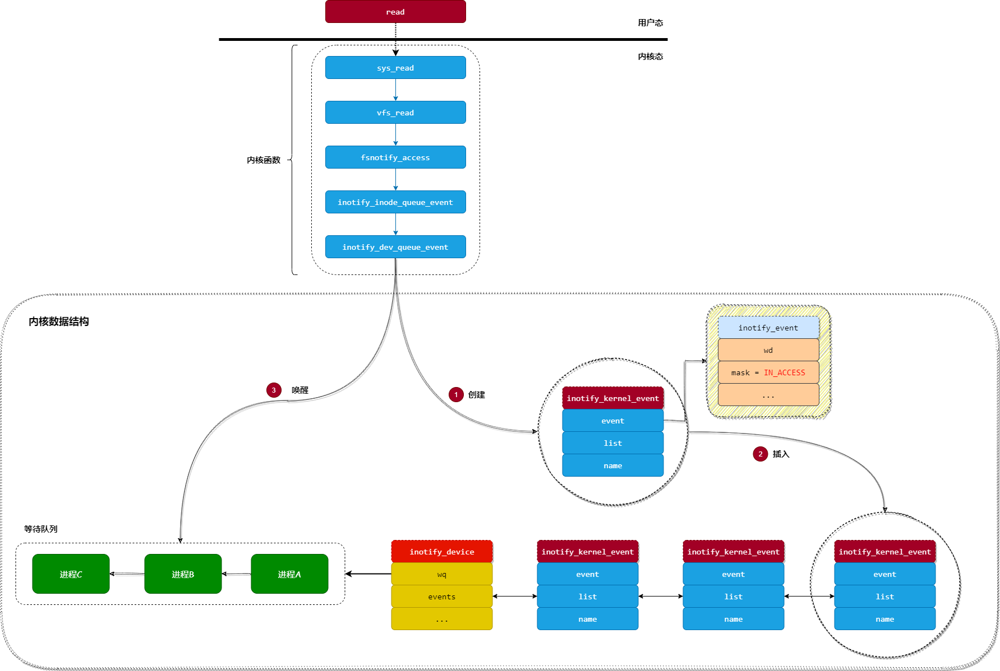
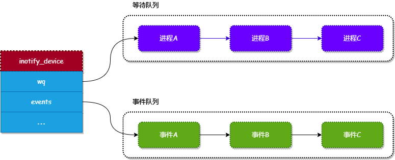
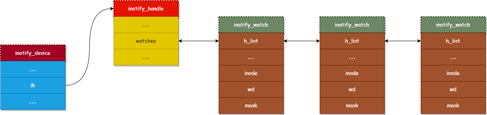

# inotify源码分析

在《[监听风云 - inotify 介绍](https://mp.weixin.qq.com/s/dmHRFWS6qz6M_5Y2MvUXew)》一文中，我们介绍了 `inotify` 的使用。为了能更深入理解 `inotify` 的原理，本文开始介绍 `inotify` 功能的实现过程。

## 重要的数据结构

>   鲁迅先生说过：程序 = 数据结构 + 算法

想想如果让我们来设计 `inotify` 应该如何实现呢？下面来分析一下：

*   我们知道，`inotify` 是用来监控文件或目录的变动事件，所以应该定义一个对象来存储这些事件（在内核中定义了 `inotify_device` 对象来存储事件）。

*   另外，当对文件或目录进行读或者写操作时才会触发事件的产生，所以应该在文件或目录的读写操作系统调用中嵌入产生事件的动作（事件由 `inotify_dev_queue_event` 函数产生）。

在介绍 `inotify` 的实现前，我们先来了解下其原理。`inotify` 的原理如下：

>   当用户调用 `read` 或者 `write` 等系统调用对文件进行读写操作时，内核会把事件保存到 `inotify_device` 对象的事件队列中，然后唤醒等待 `inotify` 事件的进程。正所谓一图胜千言，所以我们通过下图来描述此过程：




从上图可知，当应用程序调用 `read` 函数读取文件的内容时，最终会调用 `inotify_dev_queue_event` 函数来触发事件，调用栈如下：

```text
read()
└→ sys_read()
   └→ vfs_read()
      └→ fsnotify_access()
         └→ inotify_inode_queue_event()
            └→ inotify_dev_queue_event()
```

`inotify_dev_queue_event` 函数主要完成两个工作：

*   创建一个表示事件的 `inotify_kernel_event` 对象，并且把其插入到 `inotify_device` 对象的 `events` 列表中。
*   唤醒正在等待 `inotify` 发生事件的进程，等待的进程放置在 `inotify_device` 对象的 `wq` 字段中。

上面主要涉及到两个对象，`inotify_device` 和 `inotify_kernel_event`，我们先来介绍一下这两个对象的作用。

*   `inotify_device`：内核使用此对象来描述一个 `inotify`，是 `inotify` 的核心对象。
*   `intoify_kernel_event`：内核使用此对象来描述一个事件。

我们来看看这两个对象的定义。

### 1. inotify_device对象

内核使用 `inotify_device` 来管理 `inotify` 监听的对象和发生的事件，其定义如下：

```c
struct inotify_device {
    wait_queue_head_t       wq;         /* wait queue for i/o */
    ...
    struct list_head        events;     /* list of queued events */
    ...
    struct inotify_handle   *ih;        /* inotify handle */
    unsigned int            event_count;/* number of pending events */
    unsigned int            max_events; /* maximum number of events */
};
```

下面我们介绍一下各个字段的作用：

*   `wq`：正在等待当前 `inotify` 发生事件的进程列表。
*   `events`：保存由 `inotify` 监听的文件或目录所发生的事件。
*   `ih`：内核用来存储 `inotify` 监听的文件或目录，下面会介绍。
*   `event_count`：`inotify` 监听的文件或目录所发生的事件数量。
*   `max_events`：`inotify` 能够保存最大的事件数量。

下图描述了 `inotify_device` 对象中两个比较重要的队列（`等待队列` 和 `事件队列`）：




当事件队列中有数据时，就可以通过调用 `read` 函数来读取这些事件。

### 2. inotify_kernel_event对象

内核使用 `inotify_kernel_event` 对象来存储一个事件，其定义如下：

```c
struct inotify_kernel_event {
    struct inotify_event    event;  /* the user-space event */
    struct list_head        list;   /* entry in inotify_device's list */
    char                    *name;  /* filename, if any */
};
```

可以看出，`inotify_kernel_event` 对象只是对 `inotify_event` 对象进行扩展而已，而我们在《[监听风云 - inotify介绍](https://mp.weixin.qq.com/s/dmHRFWS6qz6M_5Y2MvUXew)》一文中已经介绍过 `inotify_event` 对象。

`inotify_kernel_event` 对象在 `inotify_event` 对象的基础上增加了 `list` 字段和 `name` 字段：

*   `list`：用于把所有由 `inotify` 监听的文件或目录所发生的事件连接起来，
*   `name`：用于记录发生事件的文件名或目录名。

### 3. inotify_handle对象

在 `inotify_device` 对象中，有个类型为 `inotify_handle` 的字段 `ih`，这个字段主要用来存储 `inotify` 监听的文件或目录。我们来看看 `inotify_handle` 对象的定义：

```c
struct inotify_handle {
    struct idr          idr;        /* idr mapping wd -> watch */
    ...
    struct list_head    watches;    /* list of watches */
    ...
    const struct inotify_operations *in_ops; /* inotify caller operations */
};
```

下面来介绍一下 `inotify_handle` 对象的各个字段作用：

*   `idr`：ID生成器，用于生成被监听对象（文件或目录）的ID。
*   `watches`：`inotify` 监听的对象（文件或目录）列表。
*   `in_ops`：当事件发生时，被 `inotify` 回调的函数列表。

### 4. inotify_watch对象

内核使用 `inotify_handle` 来存储被监听的对象列表，那么被监听对象是个什么东西呢？内核中使用 `inotify_watch` 对象来表示一个被监听的对象。其定义如下：

```c
struct inotify_watch {
    struct list_head        h_list; /* entry in inotify_handle's list */
    struct list_head        i_list; /* entry in inode's list */
    ...
    struct inotify_handle   *ih;    /* associated inotify handle */
    struct inode            *inode; /* associated inode */
    __s32                   wd;     /* watch descriptor */
    __u32                   mask;   /* event mask for this watch */
};
```

下面介绍一下 `inotify_watch` 对象各个字段的作用：

*   `h_list`：用于把属于同一个 `inotify` 监听的对象连接起来。
*   `i_list`：由于同一个文件或目录可以被多个 `inotify` 监听，所以使用此字段来把所有监听同一个文件的 `inotify_handle` 对象连接起来。
*   `ih`：指向其所属的 `inotify_handle` 对象。
*   `inode`：由于在 Linux 内核中，每个文件或目录都由一个 `inode` 对象来描述，这个字段就是指向被监听的文件或目录的 `inode` 对象。
*   `wd`：被监听对象的ID（或称为描述符）。
*   `mask`：被监听的事件类型（在《[监听风云 - inotify介绍](https://mp.weixin.qq.com/s/dmHRFWS6qz6M_5Y2MvUXew)》一文中已经介绍）。

现在，我们通过下图来描述一下 `inotify_device`、`inotify_handle` 和 `inotify_watch` 三者的关系：




## inotify功能实现

上面我们把 `inotify` 功能涉及的所有数据结构都介绍了，有上面的基础，现在我们可以开始分析 `inotify` 功能的实现了。

### 1. inotify_init 函数

在《[监听风云 - inotify介绍](https://mp.weixin.qq.com/s/dmHRFWS6qz6M_5Y2MvUXew)》一文中介绍过，要使用 `inotify` 功能，首先要调用 `inotify_init` 函数创建一个 `inotify` 的句柄，而 `inotify_init` 函数最终会调用内核函数 `sys_inotify_init`。我们来分析一下 `sys_inotify_init` 的实现：

```c
long sys_inotify_init(void)
{
    struct inotify_device *dev;
    struct inotify_handle *ih;
    struct user_struct *user;
    struct file *filp;
    int fd, ret;

    // 1. 获取一个没用被占用的文件描述符
    fd = get_unused_fd();
    ...
    // 2. 获取一个文件对象
    filp = get_empty_filp();
    ...
    // 3. 创建一个 inotify_device 对象
    dev = kmalloc(sizeof(struct inotify_device), GFP_KERNEL);
    ...
    // 4. 创建一个 inotify_handle 对象
    ih = inotify_init(&inotify_user_ops);
    ...
    // 5. 把 inotify_handle 对象与 inotify_device 对象进行绑定
    dev->ih = ih;
    // 6. 设置文件对象的操作函数列表为：inotify_fops
    filp->f_op = &inotify_fops;
    ...
    // 7. 将 inotify_device 对象绑定到文件对象的 private_data 字段中
    filp->private_data = dev;
    ...
    // 8. 把文件句柄与文件对象进行映射
    fd_install(fd, filp);

    return fd;
}
```

`sys_inotify_init` 函数主要完成以下几个工作：

*   调用 `get_unused_fd` 函数从进程中获取一个没被使用的文件描述符（句柄）。
*   调用 `get_empty_filp` 获取一个文件对象。
*   调用 `kmalloc` 函数申请一个 `inotify_device` 对象。
*   调用 `inotify_init` 函数创建并初始化一个 `inotify_handle` 对象。
*   把 `inotify_handle` 对象与 `inotify_device` 对象进行绑定。
*   设置文件对象的操作函数列表为：`inotify_fops`，主要提供 `read` 和 `poll` 等接口的实现。
*    将 `inotify_device` 对象绑定到文件对象的 `private_data` 字段中。
*   把文件描述符与文件对象进行映射。
*   返回文件描述符给应用层。

从上面的实现可以看出，`sys_inotify_init` 函数主要是创建 `inotify_device` 对象和 `inotify_handle` 对象，并且将它们与文件对象关联起来。

另外需要注意的是，在 `sys_inotify_init` 函数中，还把文件对象的操作函数集设置为 `inotify_fops`，主要提供了 `read` 和 `poll` 等接口的实现，其定义如下：

```c
static const struct file_operations inotify_fops = {
    .poll           = inotify_poll,
    .read           = inotify_read,
    .release        = inotify_release,
    ...
};
```

所以，当调用 `read` 函数读取 `inotify` 的句柄时，就会触发调用 `inotify_read` 函数读取 `inotify` 事件队列中的事件。

### 2. inotify_add_watch 函数

当调用 `inotify_init` 函数创建好 `inotify` 句柄后，就可以通过调用 `inotify_add_watch` 函数向 `inotify` 句柄添加要监控的文件或目录。`inotify_add_watch` 函数的实现如下：

```c
long sys_inotify_add_watch(int fd, const char __user *path, u32 mask)
{
    struct inode *inode;
    struct inotify_device *dev;
    struct nameidata nd;
    struct file *filp;
    int ret, fput_needed;
    unsigned flags = 0;

    // 通过文件句柄获取文件对象
    filp = fget_light(fd, &fput_needed);
    ...
    // 获取文件或目录对应的 inode 对象
    ret = find_inode(path, &nd, flags);
    ...
    inode = nd.dentry->d_inode;
    dev = filp->private_data;  // 从文件对象的 private_data 字段获取对应的 inotify_device 对象
    ...
    if (ret == -ENOENT)
        ret = create_watch(dev, inode, mask); // 创建一个新的 inotify_watch 对象
    ...
    return ret;
}
```

`sys_inotify_add_watch` 函数主要完成以下几个工作：

* 调用 `fget_light` 函数获取 `inotify` 句柄对应的文件对象。
* 调用 `find_inode` 函数获取 `path` 路径对应的 `inode` 对象，也就是获取要监听的文件或目录所对应的 `inode` 对象。
* 从 `inotify` 文件对象的 `private_data` 字段中，获取对应的 `inotify_device` 对象。
* 调用 `create_watch` 函数创建一个新的 `inotify_watch` 对象，并且把这个 `inotify_watch` 对象添加到 `inotify_handle` 对象的 `watches` 列表和 `inode` 对象的 `inotify_watches` 列表中。


## 事件通知

到了 `inotify` 最关键的部分，就是 `inotify` 的事件是怎么产生的。

在本文的第一部分中介绍过，当用户调用 `read` 系统调用读取文件内容时，最终会调用 `inotify_dev_queue_event` 函数来产生一个事件，我们先来回顾一下 `read` 系统调用的调用栈：

```text
read()
└→ sys_read()
   └→ vfs_read()
      └→ fsnotify_access()
         └→ inotify_inode_queue_event()
            └→ inotify_dev_queue_event()
```

下面我们来分析一下 `inotify_dev_queue_event` 函数的实现：

```c
static void
inotify_dev_queue_event(struct inotify_watch *w, u32 wd, u32 mask, u32 cookie,
                        const char *name, struct inode *ignored)
{
    struct inotify_user_watch *watch;
    struct inotify_device *dev;
    struct inotify_kernel_event *kevent, *last;

    watch = container_of(w, struct inotify_user_watch, wdata);
    dev = watch->dev;
    ...
    // 1. 申请一个 inotify_kernel_event 事件对象
    if (unlikely(dev->event_count == dev->max_events))
        kevent = kernel_event(-1, IN_Q_OVERFLOW, cookie, NULL);
    else
        kevent = kernel_event(wd, mask, cookie, name);
    ...
    // 2. 增加 inotify 事件队列的计数器
    dev->event_count++;
    // 3. 增加 inotify 事件队列所占用的内存大小
    dev->queue_size += sizeof(struct inotify_event) + kevent->event.len;

    // 4. 把事件对象添加到 inotify 的事件队列中
    list_add_tail(&kevent->list, &dev->events);

    // 5. 唤醒正在等待读取事件的进程
    wake_up_interruptible(&dev->wq);
    ...
}
```

我们先来介绍一下 `inotify_dev_queue_event` 函数各个参数的意义：

*   `w`：被监听对象，用于描述被监听的文件或目录。
*   `wd`：被监听对象的ID。
*   `mask`：发生的事件类型，可以参考《[监听风云 - inotify介绍](https://mp.weixin.qq.com/s/dmHRFWS6qz6M_5Y2MvUXew)》一文。
*   `cookie`：比较少使用，忽略。
*   `name`：发生事件的文件或目录名称。
*   `ignored`：发生事件的文件或目录的 `inode` 对象，在本函数中没有使用。

`inotify_dev_queue_event` 函数主要完成以下几个工作：

*   通过调用 `kernel_event` 函数申请一个 `inotify_kernel_event` 事件对象。
*   增加 `inotify` 事件队列的计数器。
*   增加 `inotify` 事件队列所占用的内存大小。
*   把第一步创建的事件对象添加到 `inotify` 的事件队列中。
*   唤醒正在等待读取事件的进程（因为已经有事件发生了）。

从上面的分析可以看出，`inotify_dev_queue_event` 函数只负责创建一个事件对象，并且添加到 `inotify` 的事件队列中。但发生了什么事件是由哪个步骤指定的呢？

我们可以通过分析 `read` 系统调用的调用栈，会发现在 `fsnotify_access` 函数中指定了事件的类型，我们来看看 `fsnotify_access` 函数的实现：

```c
static inline void fsnotify_access(struct dentry *dentry)
{
    struct inode *inode = dentry->d_inode;
    u32 mask = IN_ACCESS;  // 指定事件类型为 IN_ACCESS

    if (S_ISDIR(inode->i_mode))
        mask |= IN_ISDIR;  // 如果是目录, 增加 IN_ISDIR 标志
    ...
    inotify_inode_queue_event(inode, mask, 0, NULL, NULL); // 创建事件
}
```

从上面的分析可知，当发生读事件时，由 `fsnotify_access` 函数指定事件类型为 `IN_ACCESS`。其他的写事件、创建事件和删除事件都有相应的函数指定，可以查阅文件 `include/linux/fsnotify.h`。

## 总结

本文通过分析 `inotify` 的源码来了解其实现过程，从分析过程可以看出，`inotify` 的原理还是比较简单的：就是当用户调用读写、创建或删除文件的系统调用时，内核会注入相应的事件触发函数来产生一个事件，并且添加到 `inotify` 的事件队列中，然后用户就可以通过调用 `read` 函数来读取 `inotify` 事件队列中的事件。


