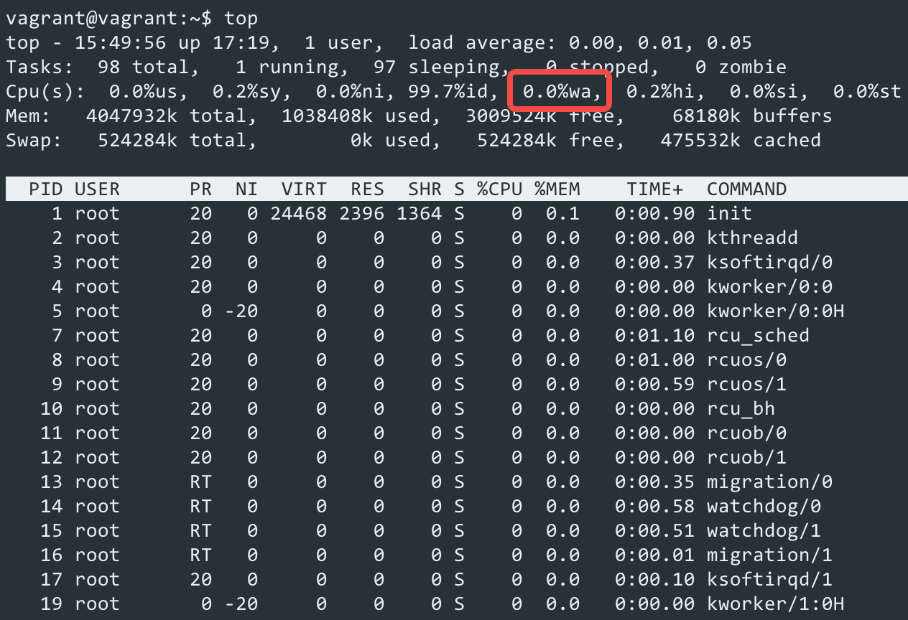
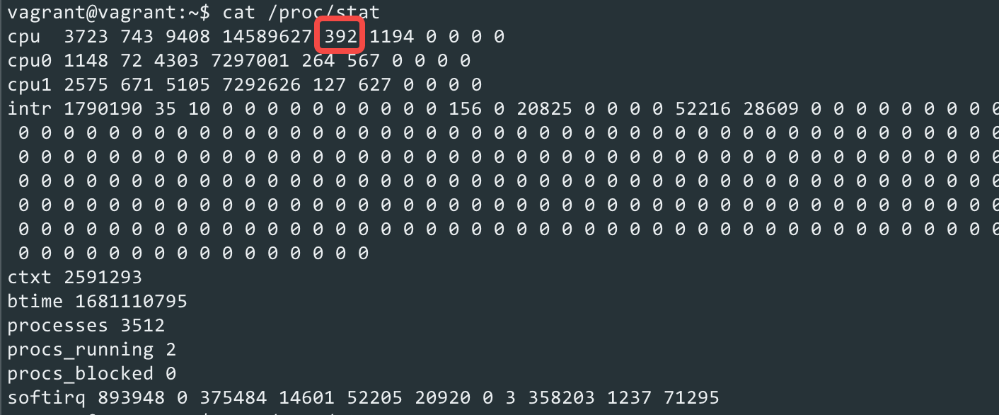

# 什么是iowait

我们对系统性能进行优化时，一般会使用 `top` 命令来查看系统负载和系统中各个进程的运行情况，从而找出影响系统性能的因素。如下图所示：



`top` 命令会输出很多系统相关的信息，如：系统负载、系统中的进程数、CPU使用率和内存使用率等，这些信息对排查系统性能问题起着至关重要的作用。

本文主要介绍 `top` 命令中的 `iowait` 指标（如上图中红色方框所示）的含义和作用。

## 什么是iowait

什么是 `iowait`？我们来看看 Linux 的解释：

> Show the percentage of time that the CPU or CPUs were idle during which the system had an outstanding disk I/O request.

中文翻译的意思就是：CPU 在等待磁盘 I/O 请求完成时，处于空闲状态的时间百分比（此时正在运行着 `idle` 进程）。

可以看出，如果系统处于 `iowait` 状态，那么必须满足以下两个条件：

1. 系统中存在等待 I/O 请求完成的进程。
2. 系统当前正处于空闲状态，也就是说没有可运行的进程。

## iowait统计原理

既然我们知道了 `iowait` 的含义，那么接下来看看 Linux 是怎么统计 `iowait` 的比率的。

Linux 会把 `iowait` 占用的时间输出到 `/proc/stat` 文件中，我们可以通过一下命令来获取到 `iowait` 占用的时间：

```bash
cat /proc/stat
```

命令输出如下图所示：



红色方框中的数据就是 `iowait` 占用的时间。

我们可以每隔一段时间读取一次 `/proc/stat` 文件，然后把两次获取到的 `iowait` 时间进行相减，得到的结果是这段时间内，CPU处于 `iowait` 状态的时间。接着再将其除以总时间，得到 `iowait` 占用总时间的比率。

现在我们来看看 `/proc/stat` 文件是怎样获取 `iowait` 的时间的。

在内核中，每个 CPU 都有一个 `cpu_usage_stat` 结构，主要用于统计 CPU 一些信息，其定义如下：

```c
struct cpu_usage_stat {
    cputime64_t user;
    cputime64_t nice;
    cputime64_t system;
    cputime64_t softirq;
    cputime64_t irq;
    cputime64_t idle;
    cputime64_t iowait;
    cputime64_t steal;
    cputime64_t guest;
    cputime64_t guest_nice;
};
```

`cpu_usage_stat` 结构的 `iowait` 字段记录了 CPU 处于 `iowait` 状态的时间。

所以要获取系统处于 `iowait` 状态的总时间，只需要将所有 CPU 的 `iowait` 时间相加即可，代码如下（位于源文件 `fs/proc/stat.c`）：

```c
static int show_stat(struct seq_file *p, void *v)
{
    u64 iowait;
    ...
    // 1. 遍历系统中的所有CPU
    for_each_possible_cpu(i) {
        ...
        // 2. 获取CPU对应的iowait时间，并相加
        iowait = cputime64_add(iowait, kstat_cpu(i).cpustat.iowait);
        ...
    }
    ...
    return 0;
}
```

`show_stat()` 函数首先会遍历所有 CPU，然后读取其 `iowait` 时间，并且将它们相加。

## 增加iowait时间

从上面的分析可知，每个 CPU 都有一个用于统计 `iowait` 时间的计数器，那么什么时候会增加这个计数器呢？

答案是：`系统时钟中断`。

在 `系统时钟中断` 中，会调用 `account_process_tick()` 函数来更新 CPU 的时间，代码如下：

```c
void account_process_tick(struct task_struct *p, int user_tick)
{
    cputime_t one_jiffy_scaled = cputime_to_scaled(cputime_one_jiffy);
    struct rq *rq = this_rq();

    // 1. 如果当前进程处于用户态，那么增加用户态的CPU时间
    if (user_tick) {
        account_user_time(p, cputime_one_jiffy, one_jiffy_scaled);
    }
    // 2. 如果前进程处于内核态，并且不是idle进程，那么增加内核态CPU时间
    else if ((p != rq->idle) || (irq_count() != HARDIRQ_OFFSET)) {
        account_system_time(p, HARDIRQ_OFFSET, cputime_one_jiffy,
                            one_jiffy_scaled);
    }
    // 3. 如果当前进程是idle进程，那么调用account_idle_time()函数进行处理
    else {
        account_idle_time(cputime_one_jiffy);
    }
}
```

我们主要关注当前进程是 `idle` 进程的情况，这是内核会调用 `account_idle_time()` 函数进行处理，其代码如下：

```c
void account_idle_time(cputime_t cputime)
{
    struct cpu_usage_stat *cpustat = &kstat_this_cpu.cpustat;
    cputime64_t cputime64 = cputime_to_cputime64(cputime);
    struct rq *rq = this_rq();

    // 1. 如果当前有进程在等待IO请求的话，那么增加iowait的时间
    if (atomic_read(&rq->nr_iowait) > 0) {
        cpustat->iowait = cputime64_add(cpustat->iowait, cputime64);
    }
    // 2. 否则增加idle的时间
    else {
        cpustat->idle = cputime64_add(cpustat->idle, cputime64);
    }
}
```

`account_idle_time()` 函数的逻辑比较简单，主要分以下两种情况进行处理：

1. 如果当前有进程在等待 I/O 请求的话，那么增加 `iowait` 的时间。
2. 如果当前没有进程在等待 I/O 请求的话，那么增加 `idle` 的时间。

所以，从上面的分析可知，要增加 `iowait` 的时间需要满足以下两个条件：

1. 当前进程是 `idle` 进程，也就是说 CPU 处于空闲状态。
2. 有进程在等待 I/O 请求完成。

进一步说，当 CPU 处于 `iowait` 状态时，说明 CPU 处于空闲状态，并且系统中有进程因为等待 I/O 请求而阻塞，也说明了 CPU 的利用率不够充分。

这时，我们可以使用异步 I/O（如 `iouring`）来优化程序，使得进程不会被 I/O 请求阻塞。

