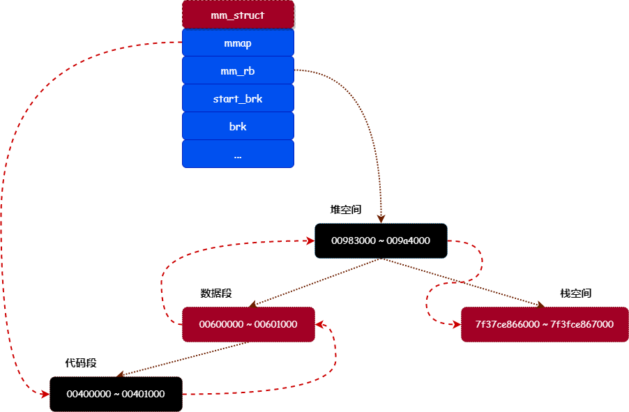
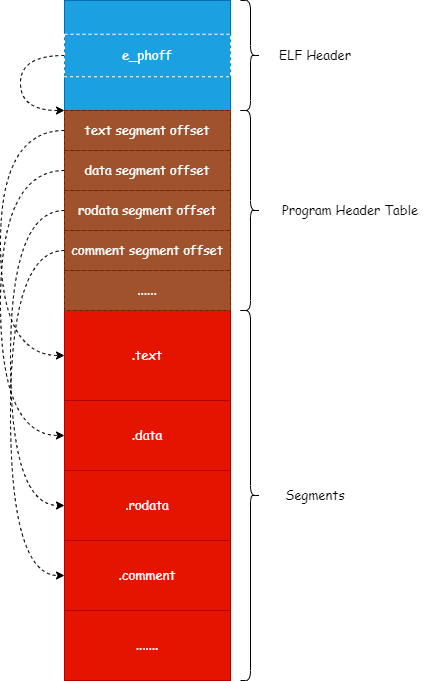
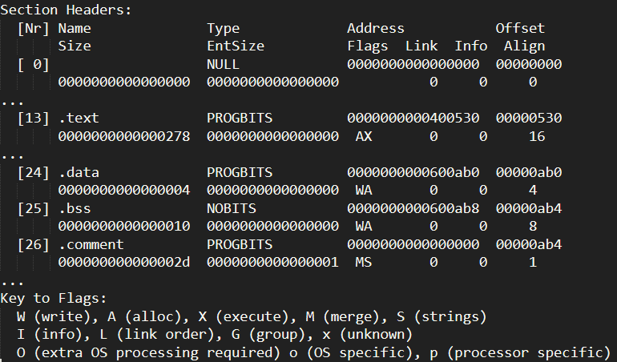

# 图解 Linux 虚拟内存空间管理

在 《[漫画解说内存映射](https://mp.weixin.qq.com/s/UP8RsAYGALxzDbS2pTAVnw)》一文中介绍过 `虚拟内存` 与 `物理内存` 映射的原理与过程，虚拟内存与物理内存进行映射的过程被称为 `内存映射`。内存映射是硬件（内存管理单元）级别的功能，必须按照硬件的规范设置好内存映射的关系，进程才能正常运行。

但内存映射并不能区分内存的用途，比如我们想知道虚拟内存区间 0 ~ 2MB 是用作存储数据还是存储指令，这就很难从内存映射中获取到相关信息。所以，Linux 根据功能上的差异，来对虚拟内存空间进行管理。

今天，我们来介绍一下 Linux 对虚拟内存空间管理的细节。

## 段

之前我们说过，在 32 位的操作系统中，每个进程都拥有 4GB 的虚拟内存空间。Linux 根据功能上的差异，把整个虚拟内存空间划分为多个不同区间，称为 `段`。

我们先来看看 Linux 进程虚拟内存空间的布局图，如图 1 所示：


上图展示了 Linux 进程的虚拟内存空间布局情况，我们只关注 `用户空间` 的布局。

从上图可以看出，进程的用户空间大小为 3GB。Linux 按照功能上的差异，把一个进程的用户空间划分为多个段，下面介绍一下各个段的作用：

*   `代码段`：用于存放程序中可执行代码的段。
*   `数据段`：用于存放已经初始化的全局变量或静态变量的段。如在 C 语言中，使用语句 `int global = 10;` 定义的全局变量。
*   `未初始化数据段`：用于存放未初始化的全局变量或静态变量的段。如在 C 语言中，使用语句 `int global;` 定义的全局变量。
*   `堆`：用于存放使用 `malloc` 函数申请的内存。
*   `mmap区`：用于存放使用 `mmap` 函数映射的内存区。
*   `栈`：用于存放函数局部变量和函数参数。

## 虚拟内存区

从上面的介绍可知，Linux 按照功能上的差异，把虚拟内存空间划分为多个 `段`。那么在内核中，是通过什么结构来管理这些段的呢？

>   答案就是：**vm_area_struct**。

内核通过 `vm_area_struct` 结构（虚拟内存区）来管理各个 `段`，其定义如下：

```c
struct vm_area_struct {
    struct mm_struct *vm_mm; /* The address space we belong to. */
    unsigned long vm_start;  /* Our start address within vm_mm. */
    unsigned long vm_end;    /* The first byte after our end address within vm_mm. */

    /* linked list of VM areas per task, sorted by address */
    struct vm_area_struct *vm_next;

    pgprot_t vm_page_prot;   /* Access permissions of this VMA. */
    unsigned long vm_flags;  /* Flags, see mm.h. */
    struct rb_node vm_rb;
    ...
    /* Function pointers to deal with this struct. */
    const struct vm_operations_struct *vm_ops;
    ...
};
```

下面介绍一下各个字段的作用：

*   `vm_mm`：指向进程的内存管理对象，每个进程都有一个类型为 `mm_struct` 的内存管理对象，用于管理进程的虚拟内存空间和内存映射等。
*   `vm_start`：虚拟内存区的起始虚拟内存地址。
*   `vm_end`：虚拟内存区的结束虚拟内存地址。
*   `vm_next`：Linux 会通过链表把进程的所有虚拟内存区连接起来，这个字段用于指向下一个虚拟内存区。
*   `vm_page_prot`：主要用于保存当前虚拟内存区所映射的物理内存页的读写权限。
*   `vm_flags`：标识当前虚拟内存区的功能特性。
*   `vm_rb`：某些场景中需要通过虚拟内存地址查找对应的虚拟内存区，为了加速查找过程，内核以虚拟内存地址作为key，把进程所有的虚拟内存区保存到一棵红黑树中，而这个字段就是红黑树的节点结构。
*   `vm_ops`：每个虚拟内存区都可以自定义一套操作接口，通过操作接口，能够让虚拟内存区实现一些特定的功能，比如：把虚拟内存区映射到文件。而 `vm_ops` 字段就是虚拟内存区的操作接口集，一般在创建虚拟内存区时指定。

我们通过图 2 来展示内核是怎么通过 `vm_area_struct` 结构来管理进程中的所有 `段`：




从上图可以看出，内核通过一个链表和一棵红黑树来管理进程中所有的 `段`。`mm_struct` 结构的 `mmap` 字段就是链表的头节点，而 `mm_rb` 字段就是红黑树的根节点。

## 加载程序镜像

前面我们介绍了 Linux  会把虚拟内存地址划分为多个 `段`，并且使用 `vm_area_struct` 结构来管理这些段。那么，这些虚拟内存区是怎么建立起来的呢？

在介绍进程虚拟内存区建立的过程前，我们先来简单介绍一下 `ELF文件格式`。

### 1. ELF文件

ELF 全称 **Executable and Linkable Format**，即可执行可链接文件格式。在 Linux 系统中，就是使用这种文件格式来存储一个可执行的应用程序。 让我们来看一下 ELF 文件格式由哪些结构组成：

一般一个 ELF 文件由以下三部分组成：

-   ELF 头（ELF header）：描述应用程序的类型、CPU架构、入口地址、程序头表偏移和节头表偏移等等；
-   程序头表（Program header table）：列举了所有有效的段（segments）和他们的属性，程序头表需要加载器将文件中的段加载到虚拟内存段中；
-   节头表（Section header table）：包含对节（sections）的描述。

ELF 文件的结构大概如图3所示：




当内核加载一个应用程序时，就是通过读取 ELF 文件的信息，然后把文件中所有的段加载到虚拟内存的段中。ELF 文件通过 `程序头表` 来描述应用程序中所有的段，表中的每一个项都描述一个段的信息。我们先来看看 `程序头表` 项的结构定义：

```c
typedef struct elf64_phdr {
    Elf64_Word p_type;     // 段的类型
    Elf64_Word p_flags;    // 可读写标志
    Elf64_Off p_offset;    // 段在ELF文件中的偏移量
    Elf64_Addr p_vaddr;    // 段的虚拟内存地址
    Elf64_Addr p_paddr;    // 段的物理内存地址
    Elf64_Xword p_filesz;  // 段占用文件的大小
    Elf64_Xword p_memsz;   // 段占用内存的大小
    Elf64_Xword p_align;   // 内存对齐
} Elf64_Phdr;
```

所以，程序加载器可以通过 ELF 头中获取到程序头表的偏移量，然后通过程序头表的偏移量读取到程序头表的数据，再通过程序头表来获取到所有段的信息。

我们可以通过 `readelf -S file` 命令来查看 ELF 文件的段（节）信息，如下图所示：



上面列出了 `代码段`、`数据段`、`未初始化数据段` 和 `注释段` 的信息。

### 2. 加载过程

要加载一个程序，需要调用 `execve` 系统调用来完成。我们来看看 `execve` 系统调用的调用栈：

```text
sys_execve
└→ do_execve
   └→ do_execveat_common
      └→ __do_execve_file
         └→ exec_binprm
            └→ search_binary_handler
               └→ load_elf_binary
```

从上面的调用者可以看出，`execve` 系统调用最终会调用 `load_elf_binary` 函数来加载程序的 ELF 文件。

由于 `load_elf_binary` 函数的实现比较复杂，所以我们分段来解说：

**（1）读取并检查ELF头**

```c
static int load_elf_binary(struct linux_binprm *bprm, struct pt_regs *regs)
{
    ...
    struct {
        struct elfhdr elf_ex;
        struct elfhdr interp_elf_ex;
    } *loc;

    loc = kmalloc(sizeof(*loc), GFP_KERNEL);
    if (!loc) {
        retval = -ENOMEM;
        goto out_ret;
    }

    // 1. 获取ELF头
    loc->elf_ex = *((struct elfhdr *)bprm->buf);

    retval = -ENOEXEC;
    // 2. 检查ELF签名是否正确
    if (memcmp(loc->elf_ex.e_ident, ELFMAG, SELFMAG) != 0)
        goto out;

    // 3. 是否是可执行文件或者动态库
    if (loc->elf_ex.e_type != ET_EXEC && loc->elf_ex.e_type != ET_DYN)
        goto out;

    // 4. 检查系统架构是否正确
    if (!elf_check_arch(&loc->elf_ex))
        goto out;
    ...
```

上面这段代码主要是读取应用程序的 ELF 头，然后检查 ELF 头信息是否合法。

**（2）读取程序头表**

```c
    size = loc->elf_ex.e_phnum * sizeof(struct elf_phdr); // 程序头表的大小
    retval = -ENOMEM;

    elf_phdata = kmalloc(size, GFP_KERNEL); // 申请一块内存来保存程序头表
    if (!elf_phdata)
        goto out;

	// 从ELF文件中读取程序头表的数据, 并且保存到 elf_phdata 变量中
    retval = kernel_read(bprm->file, loc->elf_ex.e_phoff, (char *)elf_phdata, size);
    if (retval != size) {
        if (retval >= 0)
            retval = -EIO;
        goto out_free_ph;
    }
    ...
```

上面的代码主要完成以下几个工作：

*   从 ELF 头的信息中获取到程序头表的大小。
*   调用 `kmalloc` 函数申请一块内存来保存程序头表。
*   调用 `kernel_read` 函数从 ELF 文件中读取程序头表的数据，保存到 `elf_phdata` 变量中，程序头表的偏移量可以通过 ELF 头的 `e_phoff` 字段获取。

**（3）加载段到虚拟内存**

```c
    // 遍历程序头表所有的段
    for (i = 0, elf_ppnt = elf_phdata; i < loc->elf_ex.e_phnum; i++, elf_ppnt++) {
        int elf_prot = 0, elf_flags;
        unsigned long k, vaddr;

        if (elf_ppnt->p_type != PT_LOAD)  // 判断段是否需要加载
            continue;
        ...
        // 段的可读写权限
        if (elf_ppnt->p_flags & PF_R)
            elf_prot |= PROT_READ;
        if (elf_ppnt->p_flags & PF_W)
            elf_prot |= PROT_WRITE;
        if (elf_ppnt->p_flags & PF_X)
            elf_prot |= PROT_EXEC;

        elf_flags = MAP_PRIVATE | MAP_DENYWRITE | MAP_EXECUTABLE;

        vaddr = elf_ppnt->p_vaddr;  // 获取段的虚拟内存地址
        ...
        // 把段加载到虚拟内存
        error = elf_map(bprm->file, load_bias + vaddr, elf_ppnt, elf_prot, elf_flags, 0);
        ...
    }
```

上面这段代码主要完成的工作是：

*   遍历程序头表所有的段。
*   判断段是否需要加载。
*   获取段的可读写权限和段的虚拟内存地址。
*   调用 `elf_map` 函数把段加载到虚拟内存。

所以，把段加载到虚拟内存主要通过 `elf_map` 函数完成。我们来看看 `elf_map` 函数的调用栈：

```text
elf_map
└→ do_mmap
   └→ do_mmap_pgoff
      └→ mmap_region
```

从上面的调用者可以看出，`elf_map` 函数最终会调用 `mmap_region` 来完成加载段到虚拟内存。我们分析以下 `mmap_region` 函数的实现：

```c
unsigned long 
mmap_region(struct file *file, unsigned long addr, unsigned long len, 
            unsigned long flags, unsigned int vm_flags, unsigned long pgoff)
{
    struct mm_struct *mm = current->mm;
    struct vm_area_struct *vma, *prev;
    ...
    // 申请一个 vm_area_struct 结构
    vma = kmem_cache_zalloc(vm_area_cachep, GFP_KERNEL);
    if (!vma) {
        error = -ENOMEM;
        goto unacct_error;
    }

    // 设置 vm_area_struct 结构各个字段的值
    vma->vm_mm = mm;
    vma->vm_start = addr;        // 段的开始虚拟内存地址
    vma->vm_end = addr + len;    // 段的结束虚拟内存地址
    vma->vm_flags = vm_flags;    // 段的功能特性
    vma->vm_page_prot = vm_get_page_prot(vm_flags);
    vma->vm_pgoff = pgoff;

    ...
    // 把 vm_area_struct 结构连接到虚拟内存区链表和红黑树中
    vma_link(mm, vma, prev, rb_link, rb_parent);
    ...
    
    return addr;
}
```

上面代码对 `mmap_region` 函数进行了精简，精简后的工作主要有：

*   调用 `kmem_cache_zalloc` 函数申请一个 `vm_area_struct`（虚拟内存区）结构。
*   设置 `vm_area_struct` 结构各个字段的值。
*   调用 `vma_link` 函数把 `vm_area_struct` 结构连接到虚拟内存区链表和红黑树中。

通过上面的过程，内核就把应用程序的所有段加载到虚拟内存中。

## 总结

本文主要介绍了 Linux 内核是怎么加载应用程序，并且在虚拟内存中建立各个段的布局。本文主要关注的是虚拟内存布局的建立过程，但加载应用程序的很多细节都忽略了（如怎么设置进程入口），有兴趣可以自行查阅相关的资料和书籍。


