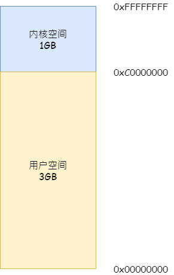
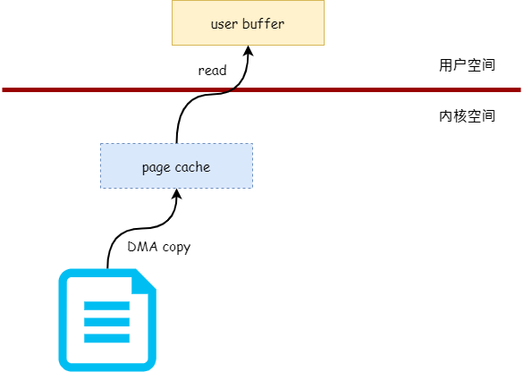
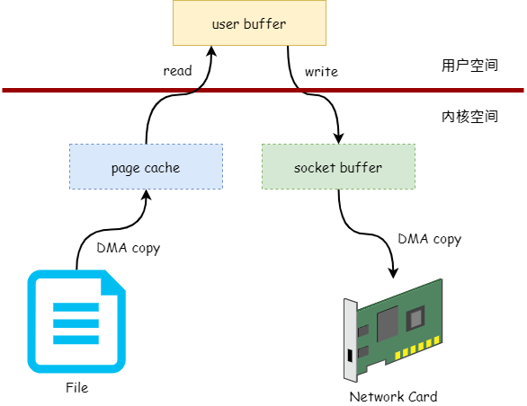
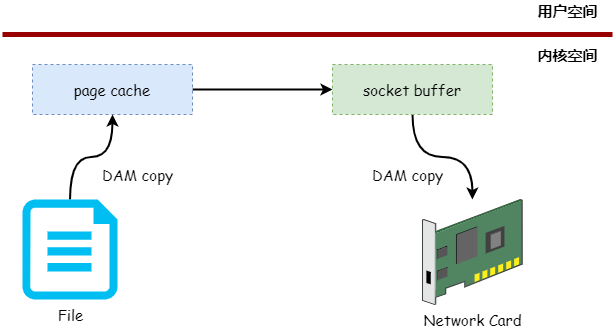
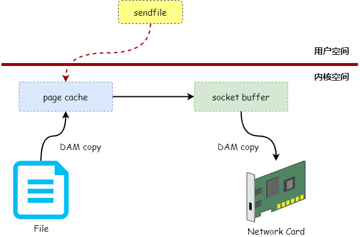

# 零拷贝技术

`零拷贝技术` 是编写高性能服务器的一个关键技术，在介绍 `零拷贝技术` 前先说明一下 `用户空间` 与 `内核空间`。

### 用户空间

通俗的说，`用户空间` 就是运行着用户编写的应用程序的虚拟内存空间。在32位的操作系统中，每个进程都有 4GB 独立的虚拟内存空间，而 0 ~ 3GB 的虚拟内存空间就是用户空间 。

### 内核空间

`内核空间` 就是运行着操作系统代码的虚拟内存空间，而 3GB ~ 4GB 的虚拟内存空间就是内核空间。

图 1 展示了 `用户空间` 与 `内核空间` 在进程虚拟内存空间所在的位置：



### 发送文件

为什么要介绍 `用户空间` 和 `内核空间` 呢？

我们先来回忆一下，服务端发送一个文件给客户端一般需要进行什么操作。一般来说，服务端发送一个文件给客户端的步骤如下：

*   首先需要调用 `read` 读取文件的数据到用户空间缓冲区中。

*   然后再调用 `write` 把缓冲区的数据发送给客户端 Socket。

    伪代码如下：

```c
while ((n = read(file, buf, 4069)) > 0) {
    write(sock, buf , n);
}
```

在上面的过程中，调用了 `read` 和 `write` 两个系统调用。`read` 系统调用是从文件中读取数据到用户空间的缓冲区中，所以调用 `read` 时需要从内核空间复制数据到用户空间，如图 2 所示：



图2 就是数据的复制过程，首先会从文件中读取数据到内核的 `页缓存（page cache）`，然后再从页缓存中复制到用户空间的缓冲区中。

而当调用 `write` 系统调用把用户空间缓冲区中的数据发送到客户端 Socket 时，首先会把缓冲区的数据复制到内核的 Socket 缓冲区中，网卡驱动会把 Socket 缓冲区的数据发送出去，如图 3 所示：




从上图可以看出，服务端发送文件给客户端的过程中需要进行两次数据复制，第一次是从内核空间的页缓存复制到用户空间的缓冲区，第二次是从用户空间的缓冲区复制到内核空间的 Socket 缓冲区。

仔细观察我们可以发现，上图中的页缓存其实可以直接复制到 Socket 缓冲区，而不需要复制到用户空间缓冲区的。如图 4 所示：




如上图所示，不需要用户空间作为数据中转的技术叫 `零拷贝技术`。那么，我们可以通过哪个系统调用来实现上图中的技术呢？答案就是 `sendfile`，我们来看看 `sendfile` 系统调用的原型：

```c
#include <sys/sendfile.h>

ssize_t sendfile(int out_fd, int in_fd, off_t *offset, size_t count);
```

下面介绍一下 `sendfile` 各个参数的作用：

*   `out_fd`：数据接收方文件句柄（一般为 Socket 句柄）。
*   `in_fd`：数据提供方文件句柄（一般为文件句柄）。
*   `offset`：如果 offset 不为 NULL，表示从哪里开始发送数据的偏移量。
*   `count`：表示需要发送多少字节的数据。

`sendfile` 发送数据的过程如图 5 所示：




对比图 5 与 图 3，我们发现使用 `sendfile` 可以减少一次系统调用，并且减少一次数据拷贝过程。

### 总结

本文主要通过 `sendfile` 系统调用来介绍 `零拷贝技术`，但 `零拷贝技术` 不单只有 `sendfile`，如 `mmap`、`splice` 和 `直接I/O` 等都是 `零拷贝技术` 的实现，有兴趣的可以参考 Linux 官方文档或相关资料。

